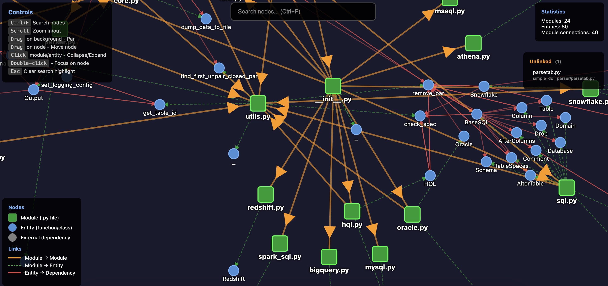
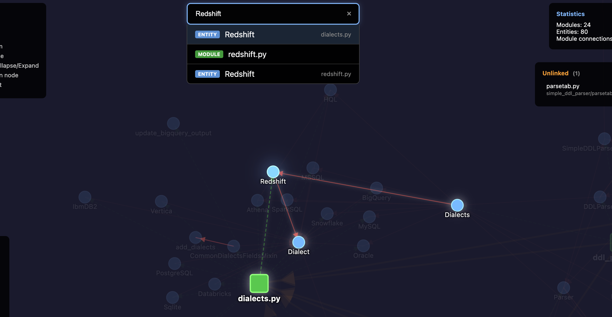
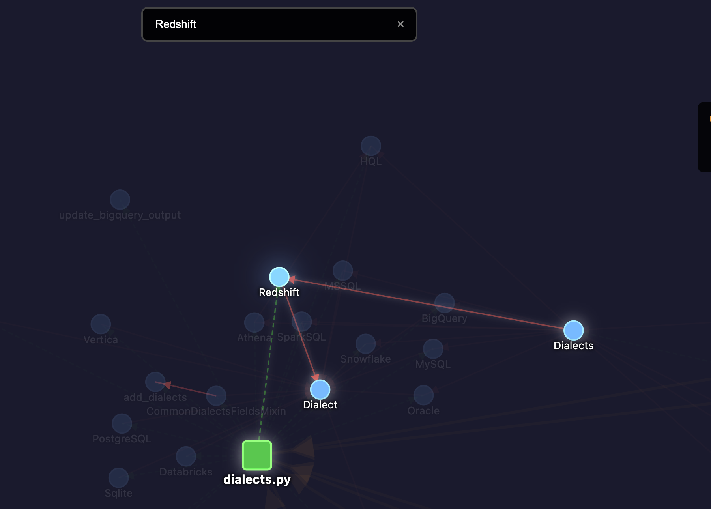
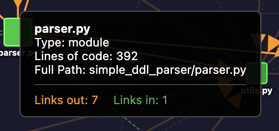
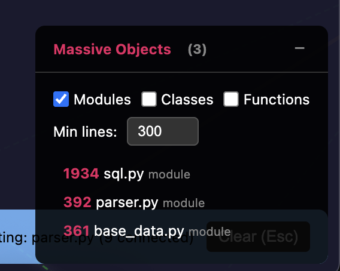
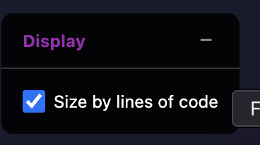
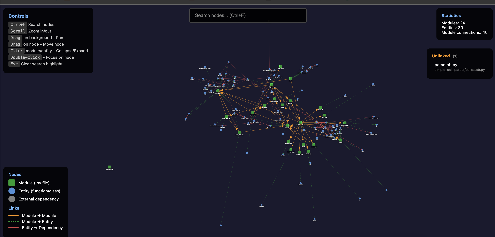

CodeGraph - static code analyzator, that create a diagram with your code structure.
^^^^^^^^^^^^^^^^^^^^^^^^^^^^^^^^^^^^^^^^^^^^^^^^^^^^^^^^^^^^^^^^^^^^^^^^^^^^^^^^^^^

.. image:: https://img.shields.io/pypi/v/codegraph
   :target: https://img.shields.io/pypi/v/codegraph
   :alt: badge1
 
.. image:: https://img.shields.io/pypi/l/codegraph
   :target: https://img.shields.io/pypi/l/codegraph
   :alt: badge2
 
.. image:: https://img.shields.io/pypi/pyversions/codegraph
   :target: https://img.shields.io/pypi/pyversions/codegraph
   :alt: badge3

.. image:: https://github.com/xnuinside/codegraph/actions/workflows/main.yml/badge.svg
   :target: https://github.com/xnuinside/codegraph/actions/workflows/main.yml/badge.svg
   :alt: workflow

.. image:: https://codecov.io/gh/xnuinside/codegraph/branch/main/graph/badge.svg
   :target: https://codecov.io/gh/xnuinside/codegraph
   :alt: codecov

`Live Demo <https://xnuinside.github.io/codegraph/>`_ - Interactive visualization of `simple-ddl-parser <https://github.com/xnuinside/simple-ddl-parser>`_ codebase

Tool that creates a diagram with your code structure to show dependencies between code entities (methods, modules, classes and etc).
Main advantage of CodeGraph is that it does not execute the code itself. You don't need to activate any environments or install dependencies to analyze the target code.
It is based only on lexical and syntax parsing, so it doesn't need to install all your code dependencies.

Interactive Visualization
^^^^^^^^^^^^^^^^^^^^^^^^^

**Zoom, Pan & Drag** - Use mouse wheel to zoom, drag background to pan, drag nodes to reposition them.

Search & Highlight
^^^^^^^^^^^^^^^^^^

**Search with Autocomplete** - Press ``Ctrl+F`` (or ``Cmd+F`` on Mac) to search. Results show node type with color coding.

**Highlight Connections** - Click on any node to highlight it and all connected nodes. Others will be dimmed.

Node Information
^^^^^^^^^^^^^^^^

**Tooltips** - Hover over any node to see details: type, parent module, full path, and connection count.

Unlinked Modules
^^^^^^^^^^^^^^^^

.. image:: img/listing_unlinked_nodes.png
   :target: img/listing_unlinked_nodes.png
   :alt: Unlinked Nodes

**Unlinked Panel** - Shows modules with no connections. Click to navigate to them on the graph.

Massive Objects Detection
^^^^^^^^^^^^^^^^^^^^^^^^^

**Massive Objects Panel** - Find large code entities (modules, classes, functions) by lines of code. Filter by type and set custom threshold.

Display Settings
^^^^^^^^^^^^^^^^

**Size by Lines of Code** - Toggle node size scaling based on lines of code. Larger nodes = more code.

UI Tips
^^^^^^^

**Built-in Help** - Legend and keyboard shortcuts are always visible in the UI.

**Draggable Panels** - All UI panels can be dragged and collapsed for a cleaner view.

----

Installation
^^^^^^^^^^^^

.. code-block:: console

   pip install codegraph

For legacy matplotlib visualization support:

.. code-block:: console

   pip install codegraph[matplotlib]

Usage
^^^^^

.. code-block:: console

   codegraph /path/to/your_python_code

This will generate an interactive HTML visualization and open it in your browser.

CLI Options
^^^^^^^^^^^

.. list-table::
   :header-rows: 1

   * - Option
     - Description
   * - ``--output PATH``
     - Custom output path for HTML file (default: ``./codegraph.html``\ )
   * - ``--matplotlib``
     - Use legacy matplotlib visualization instead of D3.js (requires ``codegraph[matplotlib]``\ )
   * - ``-o, --object-only``
     - Print dependencies to console only, no visualization

Changelog
---------

See `CHANGELOG.md <CHANGELOG.md>`_ for full version history.
